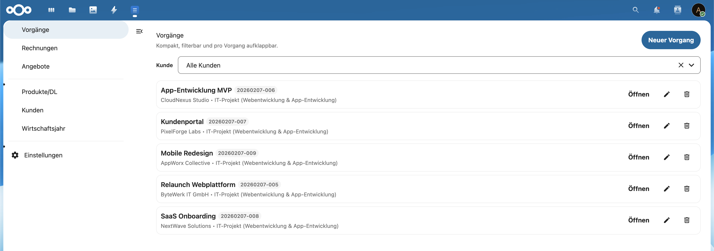
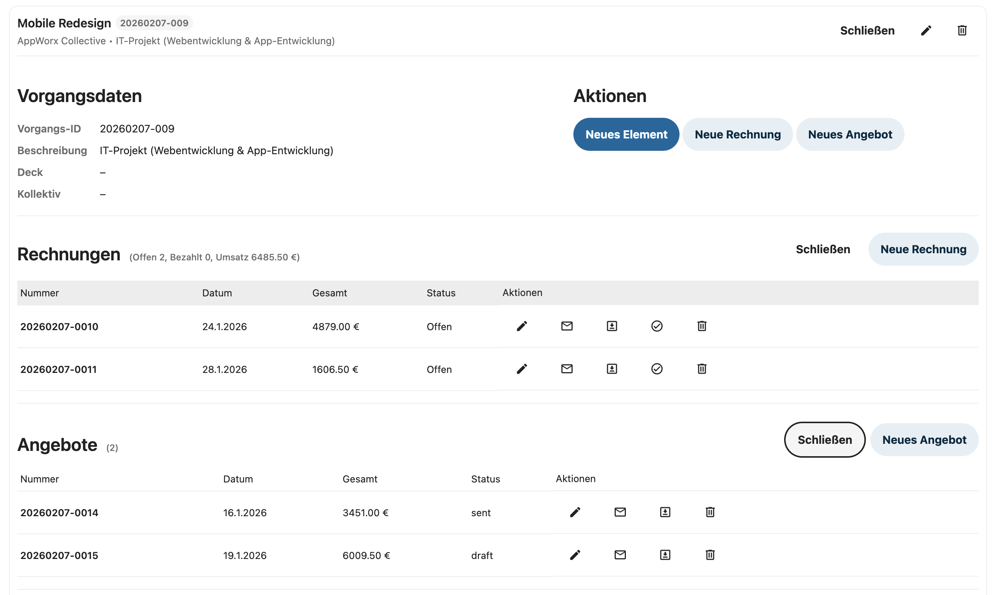
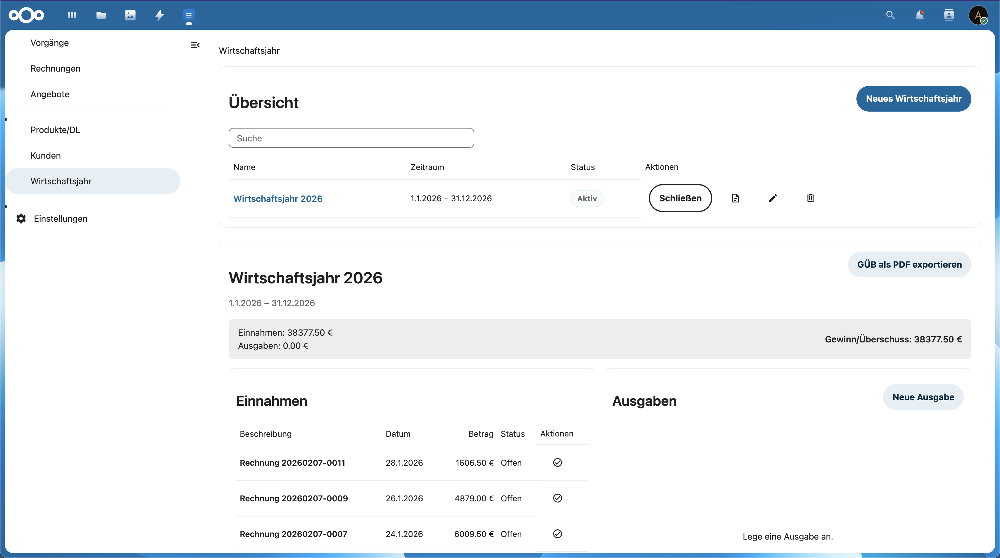
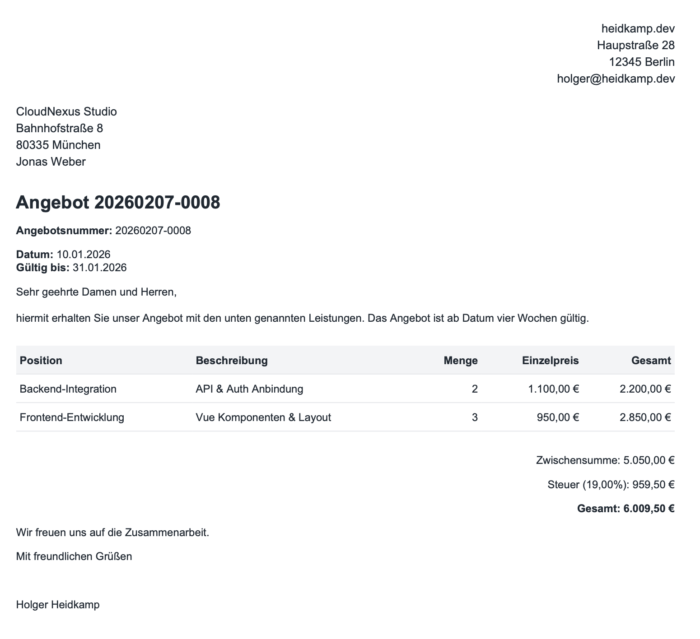
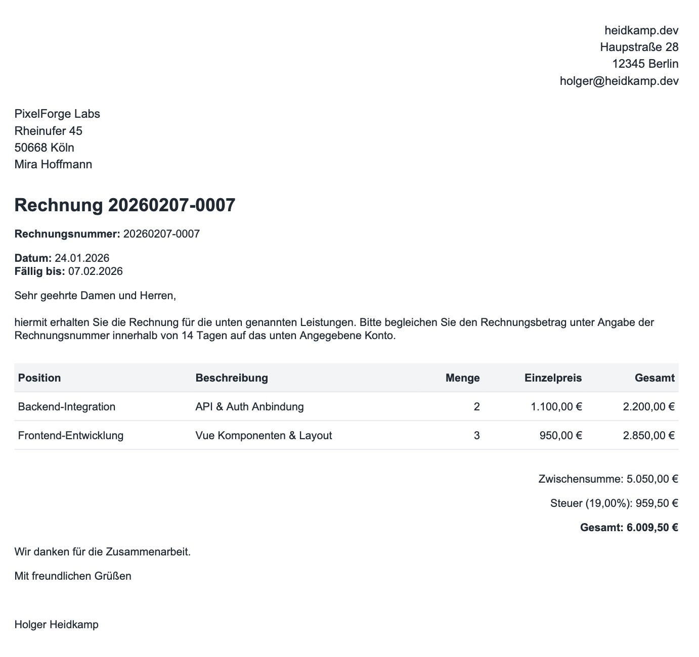
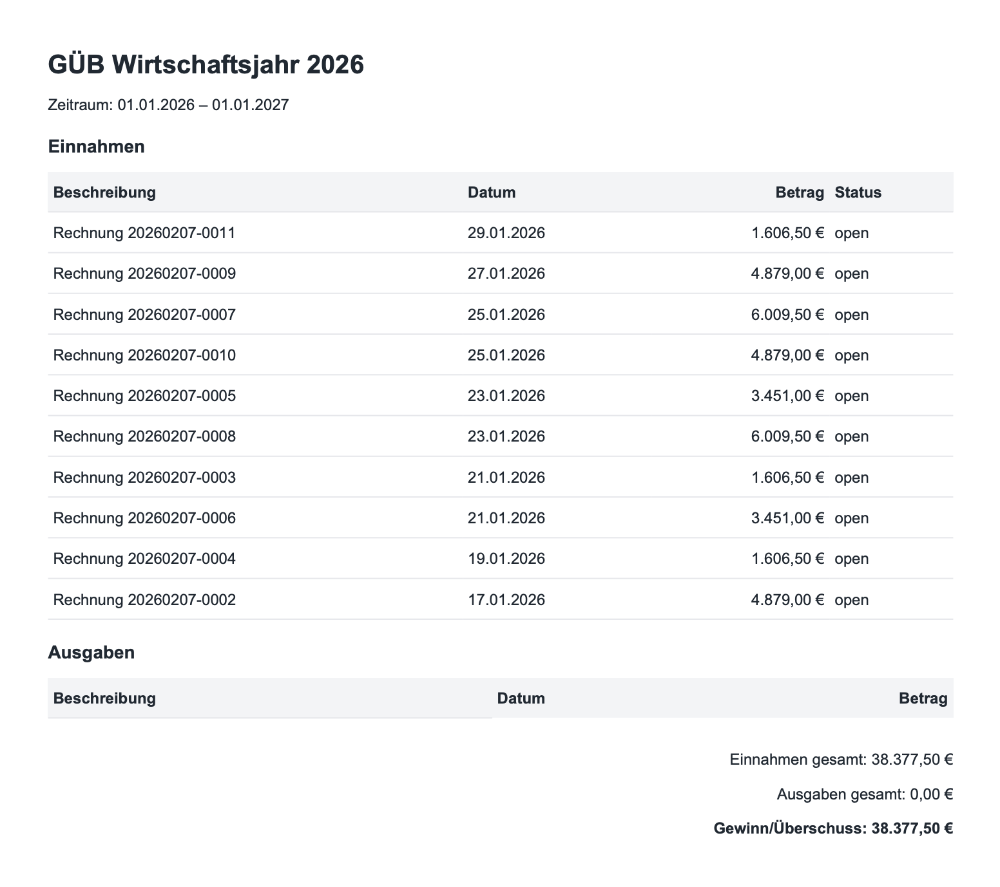
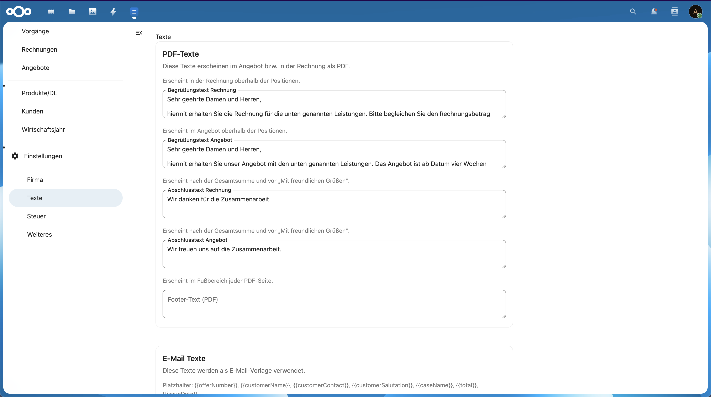
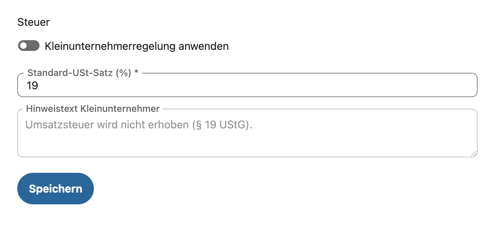

# NextLedger

A lightweight, Nextcloud‑native bookkeeping app for freelancers and small teams. Track customers, cases, offers, invoices, products, fiscal years, and GÜB (EÜR) — all inside Nextcloud with a familiar UI.

## Screenshots
Below are a few highlights from the UI and PDF output. The first four are intended for store listings; the rest are extra context for GitHub.

**Store (4 Bilder)**

**1) Vorgänge**
Filterbare Vorgangsliste mit Schnellaktionen und klarer Struktur.


**2) Vorgang-Details**
Vorgangsdaten plus verknüpfte Rechnungen & Angebote auf einen Blick.


**3) Wirtschaftsjahr**
Einnahmen, Ausgaben und Status in der Jahresübersicht.


**4) Angebot (PDF)**
Sauberes Layout für Angebote mit Positionen und Summenblock.


**Weitere Screenshots (GitHub)**

**5) Rechnung (PDF)**
Rechnungslayout mit Steuerlogik und Abschlusstext.


**6) GÜB (PDF)**
Einnahmenübersicht als PDF für das Wirtschaftsjahr.


**7) Texte & Vorlagen**
PDF- und E-Mail-Texte zentral pflegen.


**8) Steuer-Einstellungen**
Kleinunternehmerregelung und Standard-USt.


## Highlights
- **Nextcloud‑native UI** using Nextcloud Vue Components
- **Customers, Products/DL, Cases, Elements** in a clean master/detail workflow
- **Offers & Invoices** with positions, tax logic, and PDF export
- **Numbering** `YYYYMMDD-####` for offers and invoices
- **Mail‑to workflow** for offers/invoices (auto‑download PDF + template mail)
- **Fiscal Years** with **Einnahmen/Ausgaben** and **GÜB PDF** export
- **Kleinunternehmerregelung** supported (with custom note)

## What You Can Do
### Core Workflow
1. Create a **Customer**
2. Open a **Case** for the customer
3. Create **Offers** and **Invoices** from the case
4. Export PDF and send via **mailto** template
5. Track **Einnahmen/Ausgaben** in the fiscal year and export **GÜB**

### Documents
- **Offer / Invoice PDFs** follow a clean A4 layout
- Tax block adapts to **USt** or **Kleinunternehmer**
- Footer shows your closing text and (optional) bank info

### Mail Templates
Mail text supports placeholders like:
- `{{offerNumber}}`, `{{invoiceNumber}}`
- `{{customerName}}`, `{{customerContact}}`, `{{customerSalutation}}`
- `{{caseName}}`, `{{total}}`, `{{issueDate}}`

## Installation (Nextcloud)
1. Copy or clone the app into `apps/nextledger`
2. Enable the app in Nextcloud admin
3. Open **NextLedger** from the app menu

## Quick Start (Dev)
```sh
docker compose up -d
```
Open `http://localhost:8080` and log in with:
- user: `admin`
- password: `admin`

The app is mounted at `apps/nextledger` and loaded in Nextcloud as `nextledger`.

## Development
```sh
npm install
npm run dev
```

## Demo Data
Generate demo content for screenshots:
```sh
NEXTLEDGER_BASE_URL=http://localhost:8080/apps/nextledger/api \
NEXTCLOUD_USER=admin \
NEXTCLOUD_APP_PASSWORD=YOUR_APP_PASSWORD \
node scripts/seed-demo.js
```

The script creates:
- 1 active fiscal year
- 5 customers
- 5 cases (one per customer)
- 10 offers (2 per customer)
- 10 invoices (2 per customer)

Create an app password in Nextcloud under **Settings → Security**.

## PDF Export
PDF generation uses **dompdf** (server‑side). Ensure dependencies are installed:
```sh
cd apps/nextledger
composer install
```

## Data Model (Short)
- **Customers**: company, contact, address, email
- **Cases**: customer, description, deck link, kollektiv link
- **Elements**: notes and attachments per case
- **Products/DL**: name, description, unit price
- **Offers/Invoices**: positions, tax, status
- **Fiscal Years**: income/expense + GÜB

## Folder Structure
- `apps/nextledger`: Nextcloud app (backend, migrations, templates)
- `src/`: Vue UI (frontend)
- `docker-compose.yml`: Local Nextcloud 32 environment

## Privacy
All data stays in your Nextcloud instance. Mail sending is handled via `mailto:` (no server‑side email). PDFs are generated server‑side in your instance.

## License
GPL-3.0
