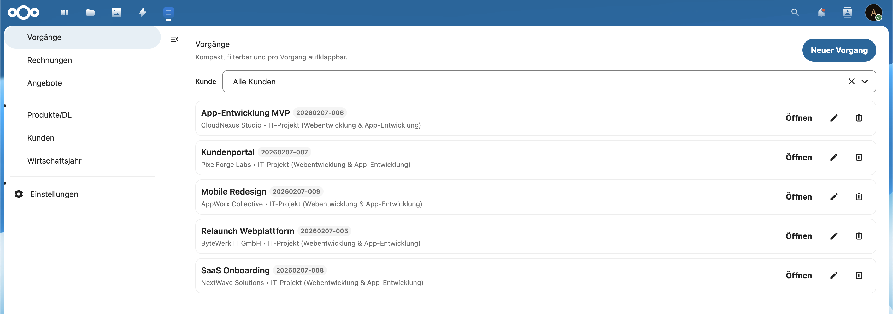
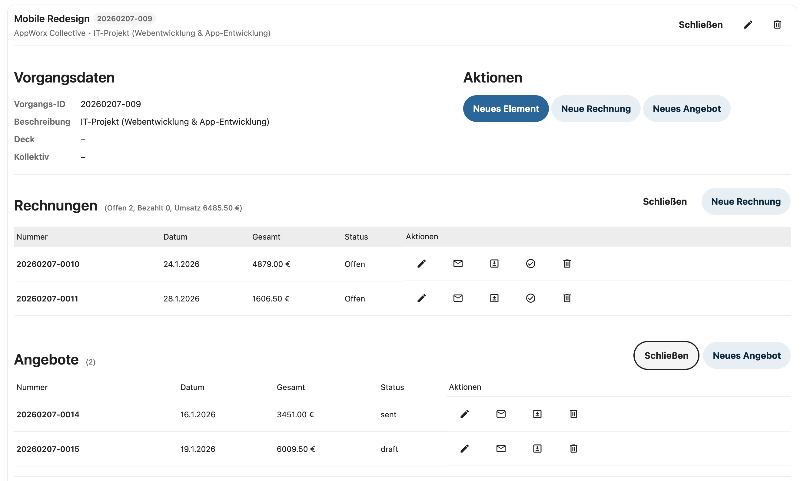
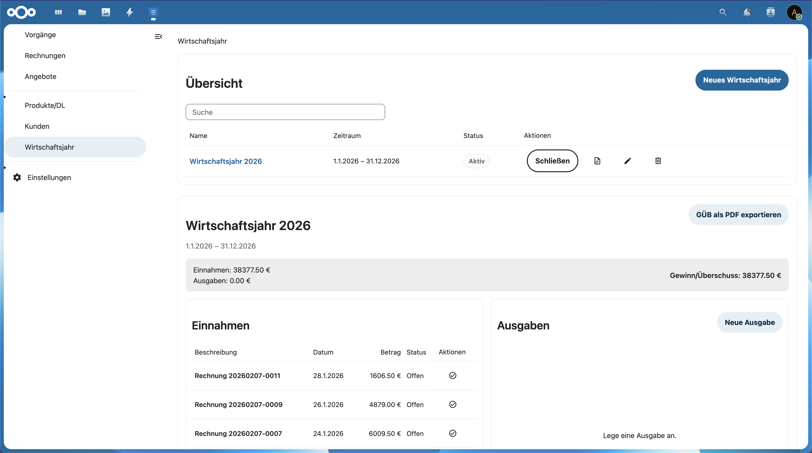
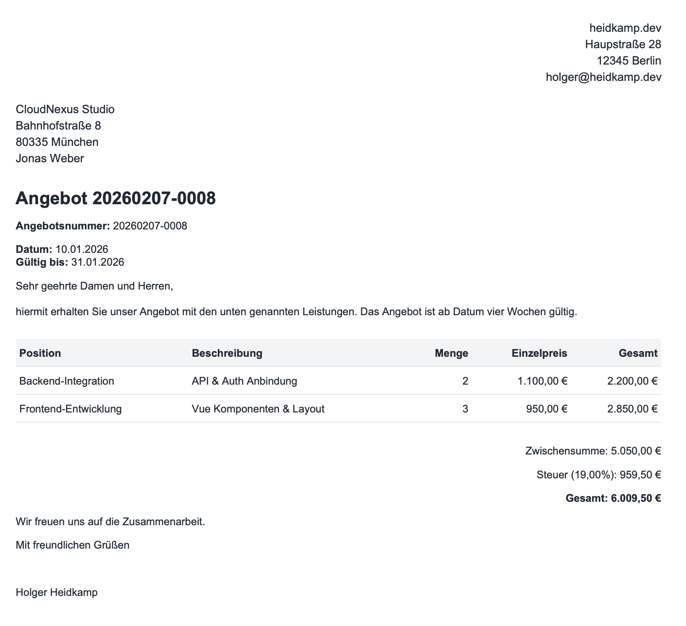
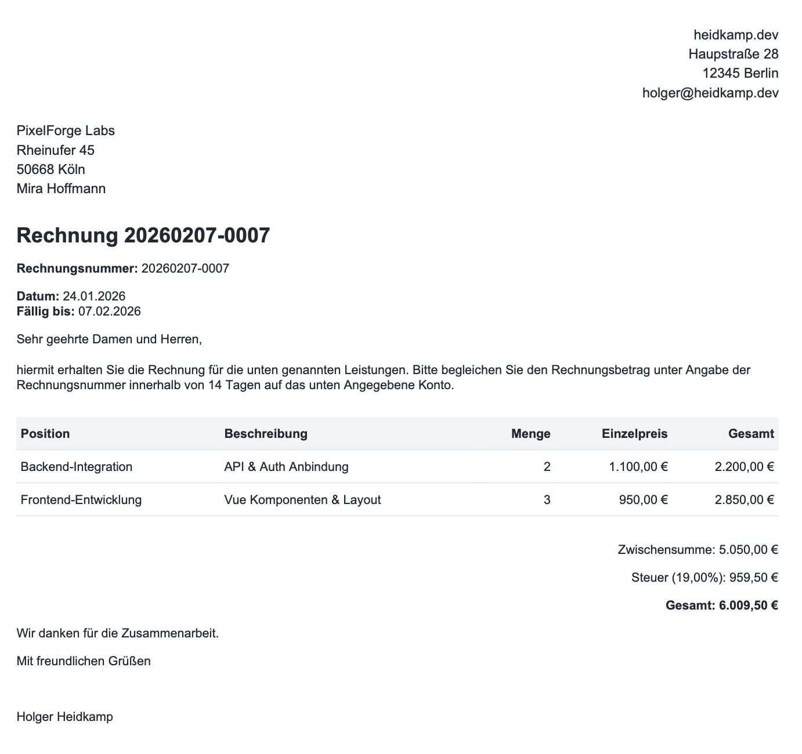
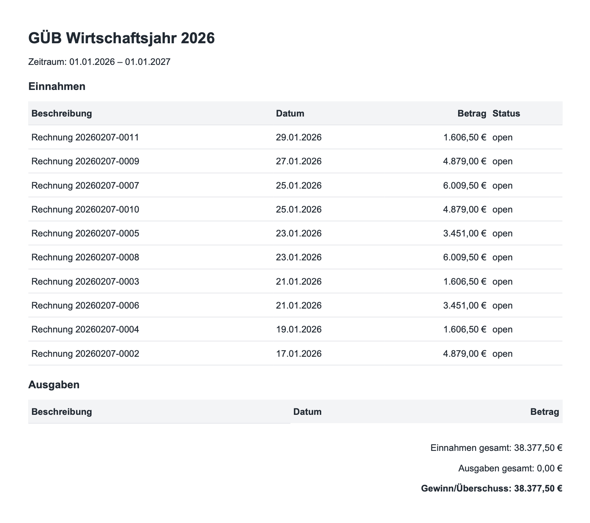
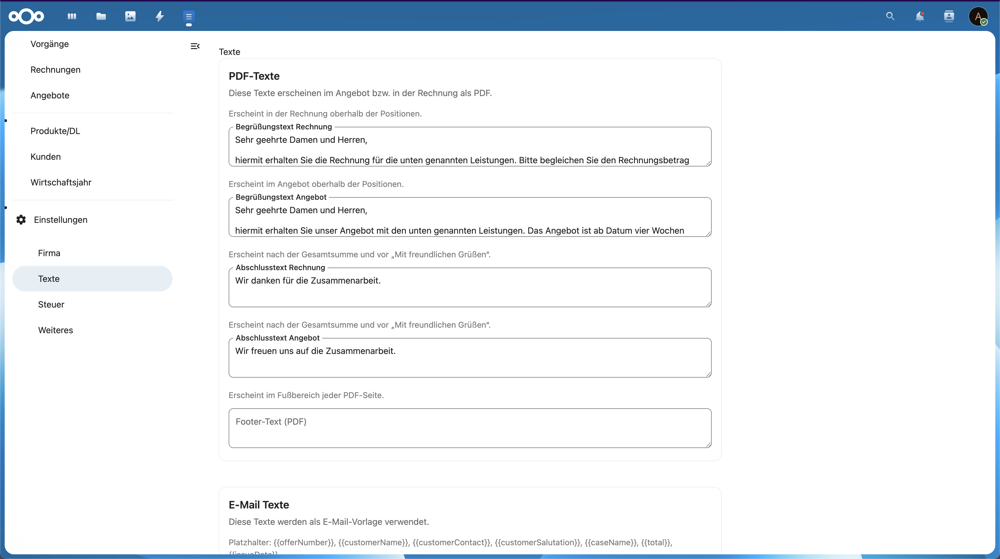
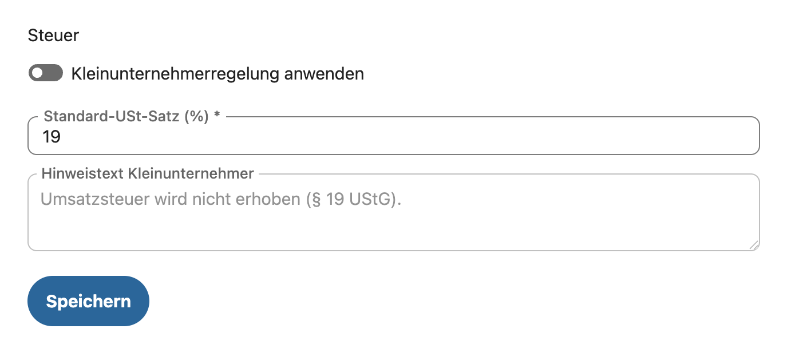

# NextLedger

A lightweight, Nextcloud‑native bookkeeping app for freelancers and small teams. Track customers, cases, offers, invoices, products, fiscal years, and GÜB (EÜR) — including **ZUGFeRD/EN16931 e‑invoicing** — all inside Nextcloud with a familiar UI.

## Video
[Information video in German on YouTube](https://youtu.be/g-ZRCY9yc5s)

## Screenshots
Below are a few highlights from the UI and PDF output. The first four are intended for store listings; the rest are extra context for GitHub.

**Store (4 Bilder)**

**1) Vorgänge**
Filterbare Vorgangsliste mit Schnellaktionen und klarer Struktur.


**2) Vorgang-Details**
Vorgangsdaten plus verknüpfte Rechnungen & Angebote auf einen Blick.


**3) Wirtschaftsjahr**
Einnahmen, Ausgaben und Status in der Jahresübersicht.


**4) Angebot (PDF)**
Sauberes Layout für Angebote mit Positionen und Summenblock.


**Weitere Screenshots (GitHub)**

**5) Rechnung (PDF)**
Rechnungslayout mit Steuerlogik und Abschlusstext.


**6) GÜB (PDF)**
Einnahmenübersicht als PDF für das Wirtschaftsjahr.


**7) Texte & Vorlagen**
PDF- und E-Mail-Texte zentral pflegen.


**8) Steuer-Einstellungen**
Kleinunternehmerregelung und Standard-USt.


## Highlights

**Invoicing & documents**
- **Offers & Invoices** with positions, tax logic, advance/final invoices, and clean A4 PDF export
- **ZUGFeRD EN16931 e‑invoicing**: PDF/A‑3 with embedded CII‑XML, switchable per company, plus a pure‑XML sidecar download for XRechnung workflows
- **Per‑position VAT rates** (e.g. 19/7/0 %) with grouped tax totals in the UI, the PDF, and the ZUGFeRD XML
- **Custom invoice number schemes** per company (e.g. `RE-{YYYY}-{SEQ4}`) with automatic counter reset per day/month/year; default remains `YYYYMMDD-####`
- **Per‑company logo** with three PDF layout sizes, plus **document layout settings** (header field visibility, company‑block position, font size)
- **Configurable closing greeting & signature name** for offer and invoice PDFs
- **Optional PDF auto‑storage** to Nextcloud Files with overwrite or versioning

**Email**
- **Direct email delivery** via Admin SMTP or a Nextcloud Mail account, with a manual mailto fallback — selectable per company
- **Editable email preview**: adjust recipients, subject, and body per email before sending, without touching the saved templates
- **Attachment policy per company**: send PDF only, ZUGFeRD‑XML only, or both

**Bookkeeping**
- **Fiscal Years** with Einnahmen/Ausgaben and **GÜB (EÜR) PDF export** in two variants
- **Receipts on expenses**: attach a PDF/image per expense, stored in Nextcloud Files under `NextLedger/<Firma>/<Wirtschaftsjahr>/Belege`
- **Recurring expenses** (monthly, quarterly, yearly, optional end date) booked automatically by a daily background job
- **Kleinunternehmerregelung** supported (with custom note)

**Platform**
- **Nextcloud‑native UI** using Nextcloud Vue Components
- **Multi‑company support** with one active company context at a time, company sharing with other Nextcloud users, and optional holding/group labels
- Customers, cases, offers, invoices, products, fiscal years, incomes, and expenses are all **scoped to the active company**
- **Bilingual** (German/English) UI and document output, multiple currencies

## What You Can Do

### Core Workflow
1. Select or create the active **Company** in settings
2. Create a **Customer**
3. Open a **Case** for the customer
4. Create **Offers** and **Invoices** from the case
5. Send documents **directly by email** (SMTP / Nextcloud Mail) or via mailto template — with editable preview and PDF/XML attachments per company setting
6. Track **Einnahmen/Ausgaben** in the fiscal year and export **GÜB**

### Documents
- **Offer / Invoice PDFs** follow a clean A4 layout
- Tax block adapts to **USt** or **Kleinunternehmer**; mixed per‑position VAT rates are grouped per rate
- The "due until" line only appears when a due date is set
- Footer shows your closing text and (optional) bank info; closing greeting and signature name are configurable under **Settings → Texte**
- Optional automatic filing to `Files/NextLedger/<Firma>/<Wirtschaftsjahr>` — overwrite existing files or create versioned files (`..._v1`, `..._v2`, ...)

### Document Layout
Configure per company under **Settings → Firma → Dokument-Layout**:
- Show or hide email, phone, VAT‑ID, and tax number in the PDF header
- Company block top right (default) or top left — the logo moves to the opposite side
- Document font size (11 / 12 / 13 px)

### Logo
- Upload one logo per company under **Settings → Firma → Logo** (PNG, JPEG, SVG, GIF, WebP, max. 1.5 MB)
- Choose one of three layout sizes:
  - `small` — 32 px high, next to the address block
  - `medium` — 64 px high, next to the address block (default)
  - `large` — 110 px high banner above the address block
- The logo is stored Base64‑encoded inside the company record (no extra Files storage needed)

### ZUGFeRD / E‑Rechnung
- Per company, choose **Settings → Firma → Rechnungsausgabe**: classic PDF (default) or **ZUGFeRD EN16931**
- ZUGFeRD generates a PDF/A‑3 with an embedded Cross Industry Invoice XML (UN/CEFACT, profile EN16931); filenames are suffixed `-zugferd.pdf`
- Mixed per‑position VAT rates are exported as one tax group (BG‑23) per rate
- Mandatory data: company name + address + country code, VAT‑ID **or** tax number; customer name + address + country code, VAT‑ID for B2B; bank IBAN is included as payment means when present
- A **sidecar XML download** is always available — via the XML button in the invoice list or `GET /api/invoices/{id}/zugferd-xml`. Use it when the recipient wants pure XRechnung XML, or when the hybrid PDF/A‑3 cannot be produced on your host
- Validation against the [Mustang validator](https://github.com/ZUGFeRD/mustangproject) or [KoSIT XRechnung Validator](https://github.com/itplr-kosit/validator) is recommended before going live
- After updating, run `composer install --no-dev --prefer-dist` inside `apps/nextledger` to pull `horstoeko/zugferd` and `setasign/fpdi`

### Invoice Numbers
- Default scheme: `YYYYMMDD-####` (per company, per day)
- Or define a custom scheme per company under **Settings → Firma**, e.g. `RE-{YYYY}-{SEQ4}`
- Placeholders: `{YYYY} {YY} {MM} {DD}` for the issue date, `{SEQ}` / `{SEQ3}`–`{SEQ6}` for the (zero‑padded) sequence
- The counter resets with the finest date placeholder used ({DD} = daily, {MM} = monthly, {YYYY}/{YY} = yearly, none = continuous)

### Expenses & Recurring Bookings
- Attach a receipt (PDF or image, max. 10 MB) to any expense; files are stored in Nextcloud Files under `NextLedger/<Firma>/<Wirtschaftsjahr>/Belege` and are never overwritten
- Mark an expense as recurring (monthly / quarterly / yearly, optional end date) — a daily background job books due occurrences automatically into the matching fiscal year

### Email Delivery
- Three delivery modes, selectable per company under **Settings → E-Mailverhalten**: Admin SMTP, a Nextcloud Mail account, or manual mailto templates
- Attachment policy per company: **PDF only**, **ZUGFeRD‑XML only**, or **both**
- The send dialog shows an **editable preview** (recipients, subject, body) — changes apply to that one email only
- Invoice recipients are controlled per customer (billing email and/or contact email switches)

### Multi-Company
- Manage multiple companies under **Settings → Firma**; exactly one company is active at a time
- Share individual companies with other Nextcloud users, including company‑specific mail settings
- Optional holding/group label to organize related companies
- Core data is company‑scoped: customers, cases, offers, invoices, products, fiscal years, incomes, expenses

### Mail Templates
Mail text supports placeholders like:
- `{{offerNumber}}`, `{{invoiceNumber}}`
- `{{customerName}}`, `{{customerContact}}`, `{{customerSalutation}}`
- `{{caseName}}`, `{{total}}`, `{{issueDate}}`

## Compatibility
- **Nextcloud 30 – 33**
- **PHP ≥ 8.1** (Composer dependencies resolved against a PHP 8.2 platform)

## Installation (Nextcloud)
1. Install from the [Nextcloud App Store](https://apps.nextcloud.com/apps/nextledger), or copy/clone the app into `apps/nextledger` and run `composer install --no-dev` inside it
2. Enable the app in Nextcloud admin
3. Open **NextLedger** from the app menu

## Quick Start (Dev)
```sh
docker compose up -d
```
Open `http://localhost:8080` and log in with:
- user: `admin`
- password: `admin`

The app is mounted at `apps/nextledger` and loaded in Nextcloud as `nextledger`.

### Enable Nextcloud Mail App (local Docker)
If you want to test NextLedger's Nextcloud Mail provider integration locally, enable the `mail` app once in the container:

```sh
docker compose exec -T --user root nextcloud chown -R www-data:www-data /var/www/html/custom_apps
docker compose exec -T nextcloud php occ config:system:set appstoreenabled --type=boolean --value=true
docker compose exec -T nextcloud php occ app:install mail
```

Verify:

```sh
docker compose exec -T nextcloud php occ app:list | rg mail
```

## Development
```sh
npm install
npm run dev
```

PHP dependencies (dompdf, ZUGFeRD):
```sh
cd apps/nextledger
composer install
```

Run the unit tests:
```sh
cd apps/nextledger
vendor/bin/phpunit
```

## Demo Data
Generate demo content for screenshots:
```sh
NEXTLEDGER_BASE_URL=http://localhost:8080/apps/nextledger/api \
NEXTCLOUD_USER=admin \
NEXTCLOUD_APP_PASSWORD=YOUR_APP_PASSWORD \
node scripts/seed-demo.js
```

The script creates:
- 1 active fiscal year
- 5 customers
- 5 cases (one per customer)
- 10 offers (2 per customer)
- 10 invoices (2 per customer)

Create an app password in Nextcloud under **Settings → Security**.

## PDF & XML Generation
- PDFs are rendered server‑side with **dompdf**
- ZUGFeRD CII‑XML and PDF/A‑3 embedding use **horstoeko/zugferd** (+ setasign/fpdi)
- Everything is generated inside your Nextcloud instance — no external services involved

## Data Model (Short)
- **Customers**: company, contact, address, email(s), country code, VAT‑ID, invoice recipient switches
- **Cases**: customer, description, deck link, kollektiv link, archive flag
- **Elements**: correspondence notes and attachments per case
- **Products/DL**: name, description, unit price
- **Offers/Invoices**: positions (with optional per‑position VAT rate), tax, status, custom field, offer reference
- **Fiscal Years**: incomes/expenses (with receipts and recurrence) + GÜB
- **Company settings**: logo, invoice format, mail attachment policy, number scheme, document layout, currency, language, country

## Folder Structure
- `apps/nextledger`: Nextcloud app (backend, migrations, background jobs, tests)
- `src/`: Vue UI (frontend)
- `docker-compose.yml`: Local Nextcloud dev environment
- `apps/nextledger/docs/`: upgrade notes and test plans

## Privacy
All data stays in your Nextcloud instance. PDFs and ZUGFeRD XML are generated server‑side in your instance; expense receipts and auto‑stored documents live in your own Nextcloud Files. Emails are sent through the delivery method **you** configure — your admin SMTP, your own Nextcloud Mail account, or manually via mailto templates. No external services are contacted.

## License
GPL-3.0
